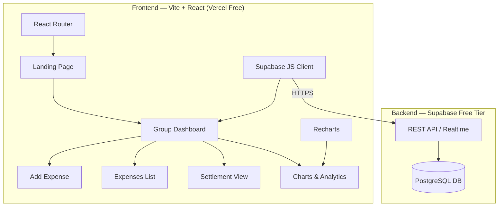
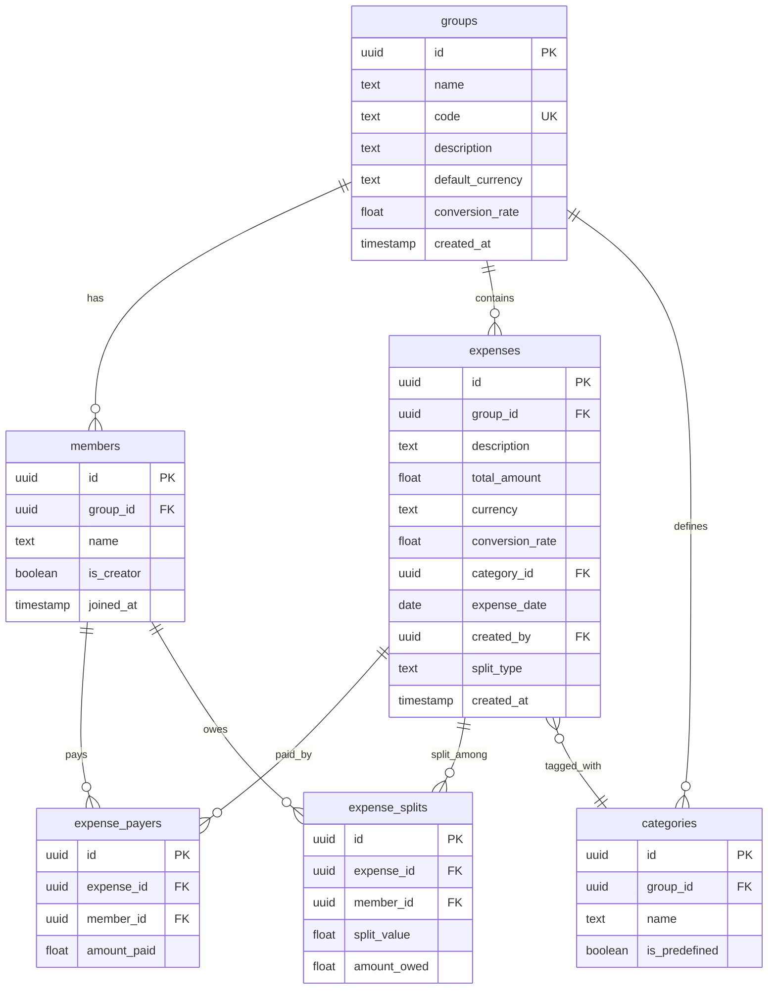
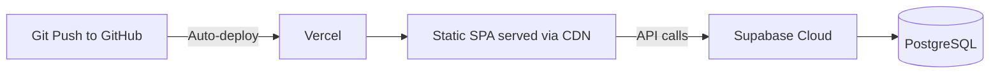

# SplitKaro — Implementation Plan

## 1. Project Overview

**SplitKaro** is a group expense splitting web app — a self-hosted, zero-cost alternative to Splitwise. Groups of friends can track shared expenses during trips/events and settle debts with minimum transactions.

> [!IMPORTANT]
> This is the **MVP scope** — focused on split expenses only. Auth, receipts, and other features are explicitly deferred.

---

## 2. Architecture



### Tech Stack Summary

| Layer | Technology | Cost |
|-------|-----------|------|
| **Frontend Framework** | Vite + React 18 | Free |
| **Routing** | React Router v6 | Free |
| **Charts** | Recharts | Free |
| **Styling** | Vanilla CSS (design system tokens) | Free |
| **Database** | Supabase PostgreSQL (500MB free) | Free |
| **Realtime** | Supabase Realtime subscriptions | Free |
| **Hosting** | Vercel (static SPA) | Free |
| **Total** | | **$0/month** |

---

## 3. Database Schema



### Table Details

#### `groups`
| Column | Type | Notes |
|--------|------|-------|
| id | UUID (PK) | Auto-generated |
| name | TEXT | e.g., "Egypt Tour 2026" |
| code | TEXT (UNIQUE) | Short shareable code, e.g., "EGYPT-26" |
| description | TEXT | Optional |
| default_currency | TEXT | Default "INR" |
| conversion_rate | FLOAT | Default 1.0 (INR to INR) |
| created_at | TIMESTAMPTZ | Auto |

#### `members`
| Column | Type | Notes |
|--------|------|-------|
| id | UUID (PK) | Auto-generated |
| group_id | UUID (FK → groups) | |
| name | TEXT | Display name (no auth) |
| is_creator | BOOLEAN | True for group creator |
| joined_at | TIMESTAMPTZ | Auto |

#### `categories`
| Column | Type | Notes |
|--------|------|-------|
| id | UUID (PK) | Auto-generated |
| group_id | UUID (FK → groups) | NULL for predefined |
| name | TEXT | e.g., "Food", "Transport" |
| is_predefined | BOOLEAN | Seed data vs custom |

Predefined categories (seeded): Food, Transport, Accommodation, Shopping, Entertainment, Tickets, Miscellaneous

#### `expenses`
| Column | Type | Notes |
|--------|------|-------|
| id | UUID (PK) | Auto-generated |
| group_id | UUID (FK → groups) | |
| description | TEXT | "Hotel Booking" |
| total_amount | FLOAT | Total in expense currency |
| currency | TEXT | "INR", "USD", etc. |
| conversion_rate | FLOAT | To INR (e.g., 83.5 for USD) |
| category_id | UUID (FK → categories) | |
| expense_date | DATE | When expense happened |
| created_by | UUID (FK → members) | Who logged it |
| split_type | TEXT | "EQUAL", "RATIO", "PERCENTAGE", "EXACT" |
| created_at | TIMESTAMPTZ | Auto |

#### `expense_payers`
| Column | Type | Notes |
|--------|------|-------|
| id | UUID (PK) | |
| expense_id | UUID (FK → expenses) | |
| member_id | UUID (FK → members) | |
| amount_paid | FLOAT | In expense currency |

#### `expense_splits`
| Column | Type | Notes |
|--------|------|-------|
| id | UUID (PK) | |
| expense_id | UUID (FK → expenses) | |
| member_id | UUID (FK → members) | |
| split_value | FLOAT | Raw input (ratio/percentage/exact) |
| amount_owed | FLOAT | Computed amount in expense currency |

---

## 4. Core Algorithm: Minimum Transaction Settlement

The settlement algorithm minimizes the number of money transfers needed:

```
1. Calculate NET balance for each member:
   net[member] = total_paid[member] - total_owed[member]

2. Separate into DEBTORS (net < 0) and CREDITORS (net > 0)

3. Sort both lists by absolute value (descending)

4. Greedy matching:
   While debtors and creditors exist:
     - Take largest debtor and largest creditor
     - Transfer min(|debtor.balance|, creditor.balance)
     - Reduce both balances
     - Remove anyone with balance = 0
```

All amounts are converted to INR using the expense's `conversion_rate` before calculation.

---

## 5. UI Screens (Stitch Designs Generated)

> [!NOTE]
> All 5 screens have been generated in the Stitch project **"SplitKaro - Expense Splitter"** (Project ID: `3107025218756071319`). You can view and edit them in [Stitch](https://stitch.withgoogle.com/projects/3107025218756071319).

| # | Screen | Description |
|---|--------|-------------|
| 1 | **Landing Page** | Hero + features + Create/Join CTAs |
| 2 | **Group Dashboard** | Members, budget summary, recent expenses, quick actions |
| 3 | **Add Expense** | Full form: amount, payers, splits, category, currency |
| 4 | **Settlement** | Who owes whom (minimum transactions), mark as paid |
| 5 | **Charts & Analytics** | Pie chart (by category), bar chart (who paid), per-person share |

### Design System: "Nexus Slate"
- **Theme**: Dark mode with glassmorphism
- **Primary**: Purple `#7C3AED`
- **Secondary**: Green `#10B981` (positive amounts / "owed")
- **Error**: Red `#ffb4ab` (negative amounts / "owes")
- **Fonts**: Manrope (headlines), Inter (body)
- **Corners**: Fully rounded
- **Background**: `#0b1326` (deep navy)

---

## 6. Project Structure

```
expense-tracker/
├── public/
│   └── favicon.svg
├── src/
│   ├── main.jsx                    # App entry
│   ├── App.jsx                     # Router setup
│   ├── index.css                   # Design system tokens + global styles
│   ├── lib/
│   │   ├── supabase.js             # Supabase client init
│   │   ├── settlement.js           # Min-transaction algorithm
│   │   └── currency.js             # Currency conversion helpers
│   ├── hooks/
│   │   ├── useGroup.js             # Group data + realtime
│   │   ├── useExpenses.js          # Expenses CRUD + realtime
│   │   ├── useMembers.js           # Members CRUD
│   │   └── useSettlement.js        # Settlement calculations
│   ├── components/
│   │   ├── Layout.jsx              # App shell + bottom nav
│   │   ├── MemberAvatar.jsx        # Colored initials circle
│   │   ├── ExpenseCard.jsx         # Expense list item
│   │   ├── SettlementCard.jsx      # "X owes Y" card
│   │   ├── CategoryChip.jsx        # Category tag
│   │   ├── SplitSelector.jsx       # Equal/Ratio/Percentage/Exact
│   │   ├── PayerSelector.jsx       # Single/Multiple payer
│   │   └── CurrencyInput.jsx       # Amount + currency + conversion
│   ├── pages/
│   │   ├── Landing.jsx             # Home — create/join group
│   │   ├── Dashboard.jsx           # Group overview
│   │   ├── AddExpense.jsx          # Add expense form
│   │   ├── ExpensesList.jsx        # All expenses in group
│   │   ├── Settlement.jsx          # Who owes whom
│   │   └── Charts.jsx             # Analytics & visualizations
│   └── data/
│       └── categories.js           # Predefined category list
├── supabase/
│   └── migrations/
│       └── 001_initial_schema.sql  # Database schema
├── index.html
├── package.json
├── vite.config.js
└── README.md
```

---

## 7. Phased Delivery Plan

### Phase 1: Foundation (Day 1-2)
- [ ] Initialize Vite + React project
- [ ] Set up Supabase project & database schema
- [ ] Create CSS design system (tokens from Stitch)
- [ ] Set up React Router with all routes
- [ ] Implement Supabase client initialization
- [ ] Create Layout component with bottom navigation

### Phase 2: Group Management (Day 2-3)
- [ ] Landing page — Create Group form (name, description, code)
- [ ] Landing page — Join Group form (enter code + name)
- [ ] Group creation with auto-generated code
- [ ] Member joining flow
- [ ] Shareable group link generation
- [ ] localStorage to remember current member identity

### Phase 3: Expense Management (Day 3-5)
- [ ] Add Expense form with all fields
- [ ] Category selection (predefined + custom)
- [ ] Payer selector (single + multiple payers)
- [ ] Split selector (Equal / Ratio / Percentage / Exact)
- [ ] Currency input with conversion rate
- [ ] Expense list view with filters
- [ ] Expense detail view
- [ ] Edit / delete expense

### Phase 4: Settlement (Day 5-6)
- [ ] Implement minimum transaction settlement algorithm
- [ ] Settlement view — who owes whom cards
- [ ] "Mark as Paid" functionality
- [ ] Net balance summary per member
- [ ] Realtime updates when expenses change

### Phase 5: Charts & Analytics (Day 6-7)
- [ ] Install & configure Recharts
- [ ] Pie chart — spending by category
- [ ] Bar chart — who paid how much
- [ ] Per-person share comparison
- [ ] Total budget overview
- [ ] Group Dashboard with summary cards

### Phase 6: Polish & Deploy (Day 7-8)
- [ ] Responsive design testing (mobile, tablet, desktop)
- [ ] Loading states & error handling
- [ ] Empty states (no expenses, no members)
- [ ] Micro-animations & transitions
- [ ] Deploy to Vercel
- [ ] README documentation

---

## 8. Deployment Plan



| Step | Action |
|------|--------|
| 1 | Create GitHub repo `expense-tracker` |
| 2 | Connect repo to Vercel (free account) |
| 3 | Create Supabase project (free tier) |
| 4 | Add Supabase URL + anon key as Vercel env vars |
| 5 | Push code → auto-deploys |

**Free subdomain**: `splitkaro.vercel.app` (or custom domain if you have one)

---

## 9. Decision Log

| # | Decision | Alternatives Considered | Why This Option |
|---|----------|------------------------|-----------------|
| 1 | **Name-based identity** (no auth) | OAuth, magic links, email-based | Simplest MVP; auth adds complexity and cost |
| 2 | **Supabase** for backend/DB | Google Sheets, Firebase, Turso, localStorage | Relational DB (perfect for splits), free tier, realtime, built-in auth for later |
| 3 | **Vite + React** for frontend | Next.js, Vue, Svelte | No SSR needed, simplest deployment as static SPA, large ecosystem |
| 4 | **Vercel** for hosting | Netlify, GitHub Pages, Cloudflare Pages | Best integration with Git, instant deploys, free tier |
| 5 | **Minimum transaction settlement** | Direct pair debts | Better UX, fewer transfers needed, what Splitwise does |
| 6 | **Predefined + Custom categories** | Predefined only, fully custom | Best of both worlds — quick selection + flexibility |
| 7 | **Recharts** for visualizations | Chart.js, D3, Nivo | React-native, declarative API, lightweight |
| 8 | **Static currency conversion** | Live API (exchangerate-api) | Zero cost, YAGNI — user controls the rate |
| 9 | **No object storage** for MVP | Supabase Storage | YAGNI — receipts can be added later |
| 10 | **Shareable link + group code** | Invite-only, open join | Flexible — works for both manual and link-based sharing |

---

## 10. Assumptions

1. Supabase free tier (500MB, 50K MAUs) is sufficient for personal/small-group use
2. Users share group links via WhatsApp/text manually
3. One currency per expense, converted to INR via manual factor
4. No offline mode needed — always online
5. Browser localStorage tracks which member "you are" in a group (no auth)
6. No concurrent editing conflicts for MVP (groups are small)

---

## 11. Risks & Mitigations

| Risk | Impact | Mitigation |
|------|--------|------------|
| Data loss (no auth = anyone can edit) | High | Use group codes + localStorage identity; add auth in V2 |
| Supabase free tier limits hit | Medium | Monitor usage; upgrade to $25/mo if needed |
| Browser localStorage cleared | Low | User re-enters name; data persists in DB |
| Currency conversion errors | Low | Clear UI showing conversion rate used |

---

## User Review Required

> [!IMPORTANT]
> **Please review the following before I start building:**
> 1. Does the database schema cover all your use cases?
> 2. Are you comfortable with Vercel for deployment? (Alternative: Netlify)
> 3. Should I proceed with the 8-day phased plan, or do you want to adjust scope?
> 4. The Stitch designs use a dark "Nexus Slate" theme — does the visual direction look good to you?

---

## Verification Plan

### Automated Tests
- Settlement algorithm unit tests (edge cases: circular debts, single member, zero amounts)
- Split calculation tests (equal, ratio, percentage, exact)
- Currency conversion tests

### Manual Verification
- Create a group, add 4 members, add 5+ expenses with different split types
- Verify settlement calculations match manual computation
- Test on mobile (Chrome DevTools responsive mode)
- Test group join via link and code
- Deploy to Vercel and test production build
